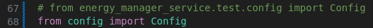
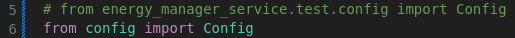

# Setup development environment

## 1. Setup Infrastructure and other HEMS services

**Pre-requesite:** INESCTEC VPN must be connected. (to access the sentinel VM)

```bash
# Databases, kafka stack and SIF
docker-compose up postgresql kafka zookeeper connect ga ga-wp cassandra cassandra-load-keyspace
# Wait a few seconds until all the containers boot up

# Debezium connector
curl -i -X POST -H "Accept:application/json" -H "Content-Type:application/json" localhost:8083/connectors/ --data-binary "@connectors/account_manager.json"

# Startup HEMS services
docker-compose up account-manager device-manager energy-prices forecast-rest-api notification-service
```

## (Optional) Access Postgresql database

```bash
psql -h 127.0.0.1 -p 5432 -U postgres -d account_manager
# Development password is set by environment variable, default: mysecretpassword
```

## (One time only) Create a development virtual environment

```bash
conda create --name <your-env> python=3.8.*
conda activate <your-env>
pip install -r requirements.txt
```

## 2. Populate test database

Go to energy_manager_service/test/setup_test_env.py.
Make sure you are using the correct config file:


Then run:

```bash
python energy_manager_service/test/setup_test_env.py
```

This script will create a test user, with a mock appliance and a mock cycle.
It also registers a forecast installation, with load forecast data for the next day.
Finally, it also registers the user's energy prices.

**IMPORTANT: You can get the user_id of the test user from the logs of this setup script.**

### (Optional) Clean test database

Go to energy_manager_service/test/clear_database.py.
Make sure you are using the correct config file:


```bash
python energy_manager_service/test/clear_database.py
```

## 3. Run the service

```bash
# From the root directory
python -m energy_manager_service
```

At this moment, the service REST API has started and it is accepting requests.

## Caveats

### 1. The test environment setup script is stuck

Sometimes the device manager gets a database transaction stuck in "idle in transaction". You can fix this with this command:

```bash
psql -h 127.0.0.1 -p 5432 -U postgres -d account_manager
```

```sql
SELECT pg_terminate_backend(pg_stat_activity.pid)
FROM pg_stat_activity
WHERE pg_stat_activity.datname = 'devicemanager'
AND pid <> pg_backend_pid();
```

Then try to run the test environemnt setup script again.

## Remarks

1. When registerig a user, the registration of the dongle fails. This is normal, because we are not mocking an influx database on these tests.
2. The registration of an installation on the Account Manager service with the forecast API fails, because the NWP grid is not correctly ajusted.
   1. This is not important for the energy manager tests, so we just register an installation directly using the forecast service REST API.
3. We can only test a functioning delay call if we have a real physical appliance. So there are no tests for a scenarion where a delay call is correcly done.
